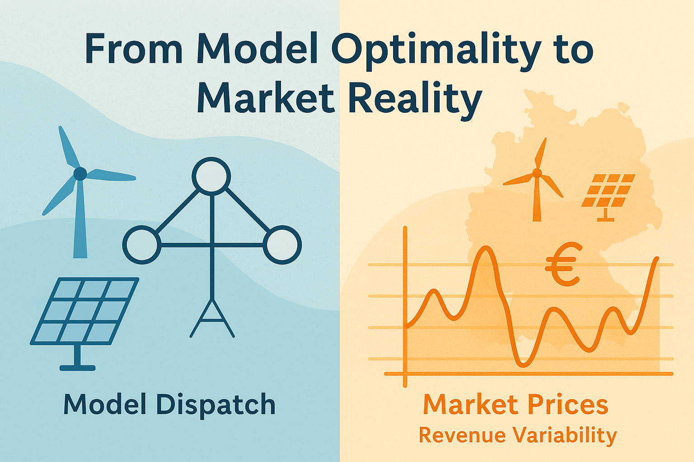

# Reproducibility Package: *From Model Optimality to Market Reality: Do Electricity Markets Support Renewable Investments?*

**Author:** Anas Abuzayed\
**Affiliations:** University of Erlangen-Nuremberg & University of Cambridge, Energy Policy Research Group (EPRG)

---

## 📘 Overview


This repository provides the code and supporting materials for the research article:

***From Model Optimality to Market Reality: Do Electricity Markets Support Renewable Investments?***

The study investigates the gap between model-based optimal dispatch and actual market outcomes in electricity markets, and evaluates how effectively price signals incentivize renewable expansion. It is built using the open-source energy system modeling framework [PyPSA](https://github.com/PyPSA/PyPSA).

[](https://doi.org/10.5281/zenodo.16394138)

---

## 📁 Repository Structure

### `Benchmarking/`

Validates the model setup and market-clearing methodology using historical market data.

- `PyPSA_model_v0.py`: Runs the power system model for the base validation.
- `Merit_plots-All_cases.py`: Illustrates market clearing and price formation mechanisms.
- `validation_plots.py`: Validates model results against observed historical data (2019–2024).
- `Data/`: Input datasets for the model.
- `Output/`: Auto-generated output folder from `PyPSA_model_v0.py`.
- `Figures/`: Auto-generated plots from the merit and validation scripts.

---

### `Feasibility/`

Assesses the future market value and investment feasibility for renewables in Germany.

- `PyPSA_model_v4.py`: Executes the model under future scenarios to evaluate system behavior.
- `Analysis.py`: Processes and visualizes key metrics, such as electricity prices and capacity trends.
- `revenueanalysis.py`: Analyzes technology-specific market revenues across different scenarios.
- `Hourly_heatmap.py`: Creates hourly price heatmaps to illustrate temporal price dynamics.
- `Data/`: Input data for feasibility analysis.
- `Output/`: Auto-generated results from running `PyPSA_model_v4.py`.
- `Figures/`: Auto-generated visualizations from all analysis scripts.

---

## ▶️ Getting Started

### 1. Clone the repository

```bash
git clone https://github.com/AnasAbuzayed/market_value.git
cd market_value
```

### 2. Run the validation analysis

```bash
cd Benchmarking
python PyPSA_model_v0.py
python validation_plots.py
```

### 3. Run the feasibility analysis

```bash
cd ../Feasibility
python PyPSA_model_v4.py
python Analysis.py
python Hourly_heatmap.py
python revenueanalysis.py
```

## 🔁 Reproducibility

- The model is built using publicaly available data. All data used is cited in the paper.
- New generated data can be reproduced from the codes in this repo and archived on [Zenodo](https://doi.org/10.5281/zenodo.16394138).

---

## ⚙️ Requirements

Install dependencies via pip (you may create a virtual environment first):

```bash
pip install numpy pandas matplotlib seaborn plotly PyPSA
```

---


## 📧 Contact

For questions, feedback, or contributions, please contact:\
📩 [anas.abuzayed@fau.de](mailto\:anas.abuzayed@fau.de)

---

## 📜 License

[](https://creativecommons.org/licenses/by/4.0/)

This project is licensed under the [Creative Commons Attribution 4.0 International (CC BY 4.0)](https://creativecommons.org/licenses/by/4.0/) license.

> 📌 Please cite the author when using any part of this repository in your own work:
> 
> **Abuzayed, A. (2025). _From Model Optimality to Market Reality: Do Electricity Markets Support Renewable Investments?_**

